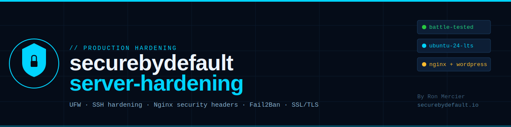

# securebydefault-server-hardening

**Production-grade Linux server hardening baseline for cloud VPS deployments.**

Built and battle-tested on the actual infrastructure behind [SecureByDefault.io](https://securebydefault.io) - a live Ubuntu 24 server on Linode that was probed by bots within 24 hours of going live. This isn't theoretical hardening. It's the exact configuration that survived real automated attacks from day one.



> 📖 **Read the full story:** [My Server Was Attacked Within 24 Hours of Going Live - Here's What the Logs Showed](https://securebydefault.io/blog/server-attacked-24-hours-live/)

---

## What This Covers

| Layer | What's Configured |
|---|---|
| **Firewall (UFW)** | Deny-by-default, allow only 22/80/443 |
| **SSH hardening** | Key-only auth, root login disabled, brute-force limits |
| **Nginx** | Security headers, blocked sensitive paths, rate limiting |
| **Fail2Ban** | SSH + Nginx jail configs, tuned ban times |
| **SSL/TLS** | Certbot + Let's Encrypt, HTTPS redirect, HSTS |
| **System** | Unattended upgrades, kernel hardening sysctl params |
| **Monitoring** | Log review checklist, attack pattern reference |

---

## The Attack That Prompted This

Within 24 hours of going live - no published links, no public traffic - bots were probing the server for:

```
/.aws/credentials
/.env
/api/.env
/backend/.env
/app/.env
/secrets.json
/serviceAccountKey.json
```

All blocked. Zero credentials stolen. The hardening worked because it was in place *before* the attacks, not after. That's the whole point of this repo.

---

## Repository Structure

```
securebydefault-server-hardening/
├── README.md                    ← You are here
├── nginx/
│   ├── securebydefault.conf     ← Full Nginx server block (HTTPS + blog routing)
│   └── security-headers.conf    ← Security headers snippet (include-ready)
├── fail2ban/
│   ├── jail.local               ← SSH + Nginx jail configuration
│   └── nginx-req-limit.conf     ← Nginx request-limit jail filter
├── ufw/
│   └── setup.sh                 ← UFW firewall setup script
├── ssh/
│   └── sshd_config.hardened     ← Hardened SSH daemon config
├── system/
│   ├── sysctl.hardened.conf     ← Kernel hardening parameters
│   └── unattended-upgrades.conf ← Automatic security updates config
├── scripts/
│   ├── harden.sh                ← Full automated hardening script
│   └── audit.sh                 ← Quick security audit check script
└── docs/
    ├── ATTACK_LOG.md            ← Real attack patterns observed post-launch
    └── CHECKLIST.md             ← Pre-launch hardening checklist
```

---

## Quick Start

> ⚠️ **Test in a staging environment first.** These configs are tuned for Ubuntu 24 LTS. Some settings (especially sysctl and SSH) may need adjustment for your specific setup.

### 1. Clone the repo

```bash
git clone https://github.com/RonMercier/securebydefault-server-hardening.git
cd securebydefault-server-hardening
```

### 2. Run the automated hardening script

```bash
chmod +x scripts/harden.sh
sudo ./scripts/harden.sh
```

This sets up UFW, hardens SSH config, enables unattended upgrades, and applies sysctl hardening parameters. Nginx and Fail2Ban configs are applied separately (see below) because they require site-specific customization.

### 3. Apply Nginx config (customize first)

```bash
# Edit the server name and paths to match your domain
nano nginx/securebydefault.conf

# Copy to Nginx sites-available
sudo cp nginx/securebydefault.conf /etc/nginx/sites-available/yourdomain.conf
sudo ln -s /etc/nginx/sites-available/yourdomain.conf /etc/nginx/sites-enabled/

# Test and reload
sudo nginx -t && sudo systemctl reload nginx
```

### 4. Apply Fail2Ban config

```bash
sudo cp fail2ban/jail.local /etc/fail2ban/jail.local
sudo cp fail2ban/nginx-req-limit.conf /etc/fail2ban/filter.d/nginx-req-limit.conf
sudo systemctl restart fail2ban
sudo fail2ban-client status
```

### 5. Verify with the audit script

```bash
chmod +x scripts/audit.sh
sudo ./scripts/audit.sh
```

---

## Key Security Decisions (and Why)

**SSH key-only authentication**
Password-based SSH auth is disabled entirely. Every failed password attempt in your logs is a bot - there are no humans typing wrong passwords at 3 a.m. Removing the attack surface entirely is cleaner than rate-limiting it.

**UFW deny-by-default**
Only ports 22, 80, and 443 are open. Everything else is silently dropped. This isn't just good security - it means your logs stay readable. Noise-free logs are logs you'll actually check.

**Blocked credential paths in Nginx**
A dedicated `location` block returns 404 for every common credential-hunting path (`.env`, `.aws`, `.git`, `credentials`, `secrets`, `xmlrpc.php`, etc.). Bots move on immediately. No application code is ever reached for these requests - they die at the web server.

**Security headers**
`X-Frame-Options`, `X-Content-Type-Options`, `X-XSS-Protection`, `Referrer-Policy`, and `server_tokens off` are set globally. These stop a category of attacks and improve your security posture score (check with securityheaders.com).

**Fail2Ban tuned, not default**
The default Fail2Ban config is too permissive - it allows too many failures before banning, and bans for too short a time. The jail config in this repo is tuned for a production server that isn't running a user authentication service: fail faster, ban harder, ban longer.

**Unattended upgrades enabled**
The most common attack vector on a VPS after credential theft is an unpatched CVE. Automatic security updates mean you're not relying on someone remembering to run `apt upgrade`. Set it, test it, forget it. Review the upgrade log monthly.

---

## Real Attack Patterns Observed (First 24 Hours)

These are actual probe paths from my Nginx logs, documented in `docs/ATTACK_LOG.md`. Every one of these is blocked by the hardening configs in this repo.

```
Credential file probes:      /.env, /.aws/credentials, /api/.env, /secrets.json
CMS exploits:                /wp-login.php, /xmlrpc.php, /wp-config.php
Admin panel discovery:       /admin, /phpmyadmin, /manager/html
Backup file hunting:         /backup.sql, /db.sql, /.git/config
Service fingerprinting:      /server-status, /info.php, /phpinfo.php
```

---

## Environment

Tested on:
- **OS:** Ubuntu 24.04 LTS
- **Web server:** Nginx 1.24+
- **PHP:** 8.3-FPM (for WordPress at `/blog` subdirectory)
- **SSL:** Let's Encrypt / Certbot
- **Firewall:** UFW
- **Intrusion prevention:** Fail2Ban 1.0+

---

## Contributing

Issues and PRs welcome. If you've observed attack patterns not in `ATTACK_LOG.md`, please open an issue - keeping that list current helps everyone.

---

## License

MIT License - use freely, adapt to your setup, no warranty implied.

---

## About

Built by **Ron Mercier** — Cloud & Cybersecurity Engineer. DDoS mitigation and incident response at Akamai Technologies. MSc Cybersecurity, CySA+, PenTest+, AWS CCP.

🌐 [securebydefault.io](https://securebydefault.io) · 📬 [Newsletter](https://newsletter.securebydefault.io) · 💼 [LinkedIn](https://www.linkedin.com/in/ron-mercier)
